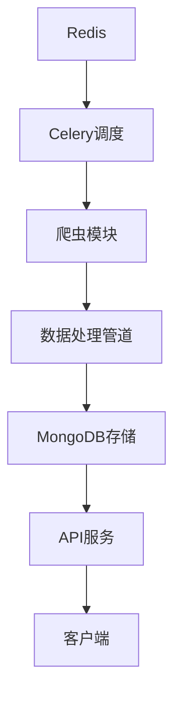

# 系统架构概览

## 整体架构



## 核心模块

1. **爬虫模块** (`crawlers/`)
   - 负责从各大平台抓取热搜数据
   - 支持多平台并行抓取
   - 实现了反爬和错误重试机制

2. **数据处理** (`crawlers/pipelines/`)
   - 数据清洗和格式化
   - 去重和验证
   - 分类打标

3. **存储层** (`app/db/`)
   - MongoDB：持久化存储
   - Redis：缓存和任务队列

4. **API服务** (`app/api/`)
   - RESTful API接口
   - 数据查询和过滤
   - 统计分析功能

5. **任务调度** (`tasks/`)
   - 定时任务管理
   - 失败重试机制
   - 任务状态监控

## 数据流向

1. **数据采集流程**
   ```
   平台热搜 -> 爬虫模块 -> 数据清洗 -> MongoDB存储
   ```

2. **数据查询流程**
   ```
   客户端请求 -> API接口 -> 数据库查询 -> 数据处理 -> 响应结果
   ```

3. **任务调度流程**
   ```
   Celery Beat -> Redis -> Celery Worker -> 爬虫任务 -> 数据处理
   ```

## 关键技术

- FastAPI：高性能Web框架
- Scrapy：分布式爬虫框架
- MongoDB：文档数据库
- Redis：缓存和消息队列
- Celery：分布式任务队列 