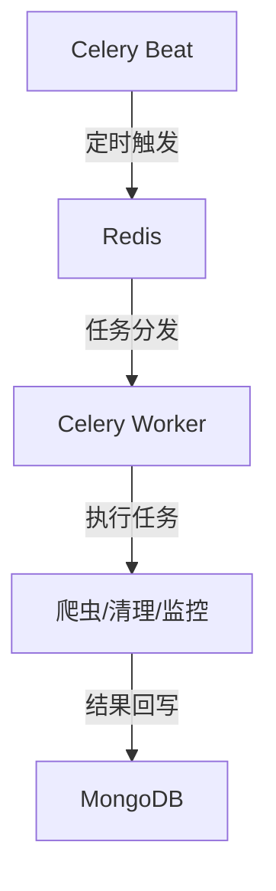

# 任务调度模块说明文档

## 模块结构

```
tasks/
├── celery_app.py     # Celery应用配置
├── crawl.py          # 爬虫任务定义
├── clean.py          # 数据清理任务
└── monitor.py        # 监控任务
```

## 任务类型

### 1. 爬虫任务

#### 1.1 定时爬取任务
```python
@celery_app.task
def crawl_platform(platform: str):
    """
    定时爬取指定平台的热搜数据
    参数:
        platform: 平台名称 (weibo/baidu/zhihu/douyin/bilibili)
    """
```

#### 1.2 全量更新任务
```python
@celery_app.task
def crawl_all_platforms():
    """
    全量更新所有平台的热搜数据
    """
```

### 2. 数据清理任务

#### 2.1 过期数据清理
```python
@celery_app.task
def clean_expired_data():
    """
    清理超过保留期限的历史数据
    默认保留7天数据
    """
```

#### 2.2 数据去重任务
```python
@celery_app.task
def deduplicate_data():
    """
    清理重复的热搜数据
    """
```

### 3. 监控任务

#### 3.1 系统监控
```python
@celery_app.task
def monitor_system():
    """
    监控系统资源使用情况
    包括CPU、内存、磁盘等
    """
```

#### 3.2 任务监控
```python
@celery_app.task
def monitor_tasks():
    """
    监控任务执行情况
    包括成功率、执行时间等
    """
```

## 调度配置

### 1. 定时任务配置

```python
CELERYBEAT_SCHEDULE = {
    # 热搜爬取任务
    'crawl-weibo': {
        'task': 'tasks.crawl.crawl_platform',
        'schedule': crontab(minute='*/60'),  # 每小时
        'args': ('weibo',)
    },
    # 数据清理任务
    'clean-expired': {
        'task': 'tasks.clean.clean_expired_data',
        'schedule': crontab(hour='3', minute='0'),  # 每天凌晨3点
    },
    # 监控任务
    'system-monitor': {
        'task': 'tasks.monitor.monitor_system',
        'schedule': crontab(minute='*/5'),  # 每5分钟
    }
}
```

### 2. 任务优先级

```python
CELERY_TASK_ROUTES = {
    'tasks.crawl.*': {'queue': 'crawl'},
    'tasks.clean.*': {'queue': 'clean'},
    'tasks.monitor.*': {'queue': 'monitor'}
}
```

## 执行流程

### 1. 任务触发



### 2. 错误处理

1. **重试机制**
   ```python
   @celery_app.task(
       bind=True,
       max_retries=3,
       default_retry_delay=300
   )
   def crawl_with_retry(self, platform):
       try:
           return crawl_platform(platform)
       except Exception as exc:
           self.retry(exc=exc)
   ```

2. **失败处理**
   - 错误日志记录
   - 告警通知
   - 人工干预

## 监控和管理

### 1. Flower监控

- 访问地址: http://localhost:5555
- 监控指标:
  - 任务执行状态
  - Worker状态
  - 队列长度
  - 执行时间

### 2. 日志记录

```python
CELERY_LOGGING = {
    'format': '%(asctime)s - %(name)s - %(levelname)s - %(message)s',
    'level': 'INFO',
    'handlers': ['console', 'file']
}
```

### 3. 性能优化

1. **Worker配置**
   ```python
   CELERY_WORKER_PREFETCH_MULTIPLIER = 1
   CELERY_WORKER_MAX_TASKS_PER_CHILD = 100
   CELERY_WORKER_CONCURRENCY = 4
   ```

2. **任务配置**
   ```python
   CELERY_TASK_SOFT_TIME_LIMIT = 300
   CELERY_TASK_TIME_LIMIT = 600
   CELERY_TASK_COMPRESSION = 'gzip'
   ```

## 扩展性设计

### 1. 动态任务

```python
def create_dynamic_task(platform, frequency):
    """
    动态创建爬虫任务
    """
    return {
        f'crawl-{platform}': {
            'task': 'tasks.crawl.crawl_platform',
            'schedule': crontab(minute=f'*/{frequency}'),
            'args': (platform,)
        }
    }
```

### 2. 任务组合

```python
from celery import chain, group

# 串行任务
task_chain = chain(
    crawl_platform.s('weibo'),
    clean_expired_data.s(),
    monitor_system.s()
)

# 并行任务
task_group = group(
    crawl_platform.s(platform)
    for platform in ['weibo', 'baidu', 'zhihu']
)
```

## 部署配置

### 1. Docker部署

```yaml
celery-worker:
  image: news-trending
  command: celery -A tasks.celery_app worker --loglevel=info
  environment:
    - CELERY_BROKER_URL=redis://redis:6379/1
    - CELERY_RESULT_BACKEND=redis://redis:6379/2

celery-beat:
  image: news-trending
  command: celery -A tasks.celery_app beat --loglevel=info
  environment:
    - CELERY_BROKER_URL=redis://redis:6379/1
    - CELERY_RESULT_BACKEND=redis://redis:6379/2
```

### 2. 扩展配置

```yaml
celery-worker:
  deploy:
    replicas: 3
    resources:
      limits:
        cpus: '0.50'
        memory: 512M
``` 